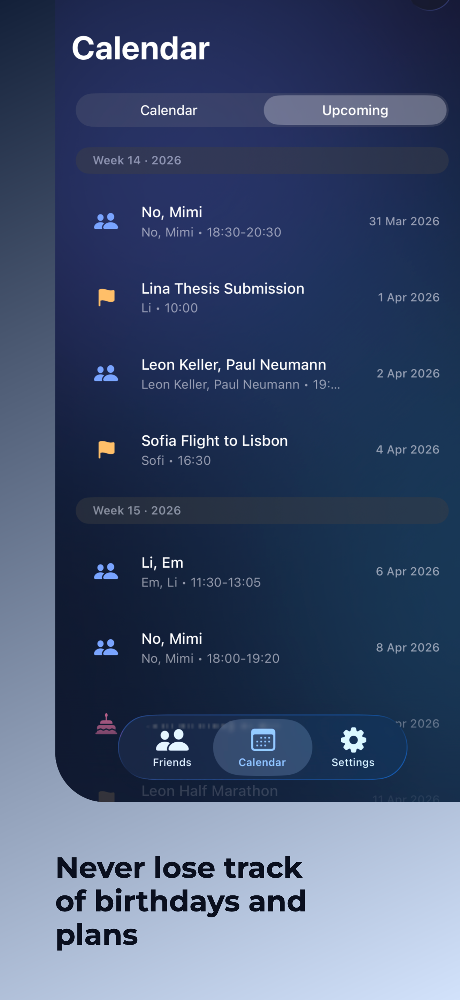
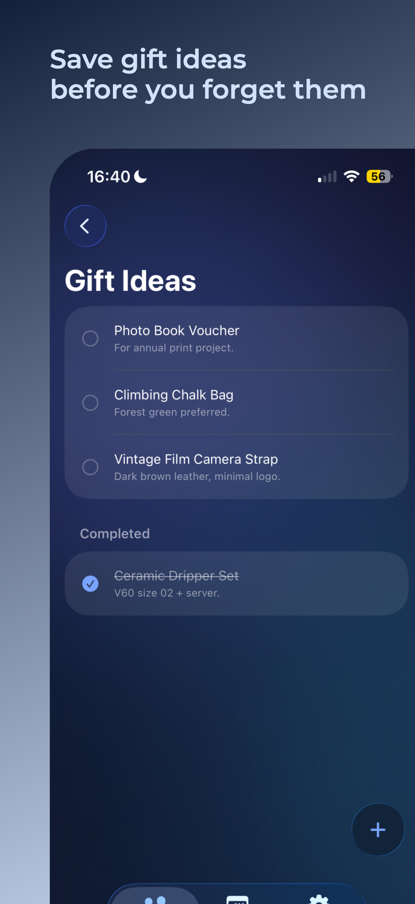

# Friend Notes (iOS)

Friend Notes helps you stay close to the people who matter most.  
Track friends, birthdays, meetings/events, and gift ideas in one private, local-first app.

**Status:** The app is currently **not** available on the App Store.
  
**Platform:** iPhone only (portrait mode).

## Target & Quick Start

Friend Notes is built for people who want a lightweight personal CRM without complexity.  
It turns scattered mental notes into a simple, searchable workflow on iPhone.

## Features

Friend Notes is designed as a personal relationship manager that stays lightweight and practical in daily life.

- Build and maintain a clear friend database with name, nickname, birthday, tags, favorites, and personal profile context.
- Store rich friend-specific notes in structured categories like hobbies, food preferences, music, movies/series, and free-text notes.
- Keep relationship history alive by adding entries and context over time instead of losing details in chats or memory.
- Plan meetings and events with exact date/time, participants, type, and notes so plans are visible and easy to manage.
- Create events directly in context of a friend or from the calendar flow.
- Track everything in two planning modes: calendar view for date-based planning and upcoming list for near-term priorities.
- Capture gift ideas globally and per friend, including notes and links, and mark items as completed once gifted.
- Configure reminder behavior for birthdays, meetings, events, long time no see, and post-meeting follow-ups.
- Open the right screen directly from notifications via deep-link routing.
- Manage reusable global friend tags centrally in settings and assign them quickly across profiles.
- Use the app fully offline with local data persistence and local notifications.
- Switch between German and English with built-in localization.

## Screenshots

<p align="center">
  
  
  
</p>

## Tech Stack

- `Swift` + `SwiftUI`
- `SwiftData` for persistence
- `UserNotifications` for local reminders
- `XCTest` for unit tests
- `Localizable.strings` + lightweight `L10n` helper for localization

## Architecture

The app follows a **feature-first SwiftUI architecture** with a clear separation of concerns:

- `Domain`: core models (`Friend`, `Meeting`, `GiftIdea`, `FriendEntry`) and localization helper
- `Features`: screen-level UI grouped by business feature (`Friends`, `Calendar`, `Gifts`, `Meetings`, `Settings`)
- `Services`: cross-cutting services such as notification scheduling/routing
- `UI`: reusable components and visual theme primitives
- `App`: app entry point and support utilities

Key decisions:

- Local-first data model with `SwiftData` (no backend dependency).
- Shared notification scheduler that rebuilds reminders from persisted models + global settings.
- Centralized global settings via `@AppStorage`.

## Installation / Setup

### Requirements

- macOS with **Xcode 26.2+**
- iOS Simulator or device with **iOS 26.2+**

### Steps

1. Open the iOS project:
   ```bash
   cd apps/ios/Friend\ Notes
   open "Friend Notes.xcodeproj"
   ```
2. Select the **Friend Notes** scheme.
3. Select an iPhone simulator/device.
4. Build and run (`Cmd + R`).

### Run Unit Tests

- In Xcode: `Cmd + U`
- Test target: `Friend NotesTests`

## Project Structure

```text
friend-notes/
├─ apps/
│  └─ ios/
│     └─ Friend Notes/
│        ├─ Friend Notes.xcodeproj
│        ├─ Friend Notes/        # iOS app source
│        │  ├─ App/              # App entry + app-level support
│        │  ├─ Domain/           # Models + localization
│        │  ├─ Features/         # Feature modules (Friends/Calendar/Gifts/...)
│        │  ├─ Services/         # Notification and other services
│        │  └─ UI/               # Shared UI components + theme
│        └─ Friend NotesTests/   # Unit tests
├─ assets/
│  └─ design/                    # Logo/icon source files and exports
├─ docs/
│  └─ screenshots/
│     └─ ios/                    # App screenshots used in docs
├─ README.md
└─ LICENSE
```

## Usage

1. Create friends in the **Friends** tab.
2. Add profile context (tags, birthday, notes, interests).
3. Schedule meetings/events via **Calendar** or from a friend profile.
4. Track gift ideas in **Gifts** and assign them to friends.
5. Configure reminder behavior in **Settings**.

## Configuration

- No API keys or external services are required.
- Notifications require user permission at runtime.
- Global notification behavior is configured in app settings.
- Global friend tags are managed centrally in settings and reused across profiles.

## License

This project is licensed under the terms of the [LICENSE](./LICENSE) file.
