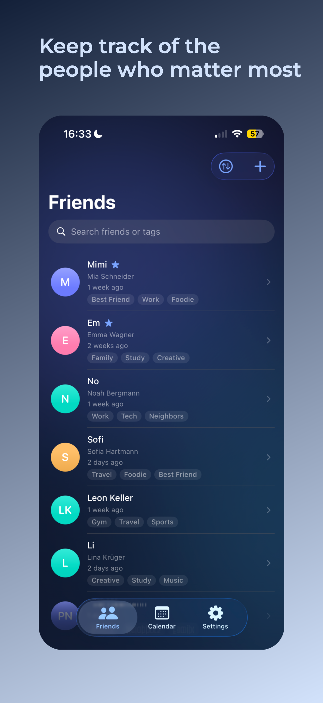

# FriendsApp

FriendsApp is an iOS app built to help you take better care of your friendships in everyday life. Instead of relying on memory alone, the app gives you a structured and private place to keep track of the people who matter to you: their personal details, shared moments, birthdays, and meaningful notes.

The goal is simple: make it easier to stay connected consistently. FriendsApp helps you remember important dates, plan meetings and events, capture gift ideas, and maintain context over time so relationships do not fade in a busy schedule.

## Screenshots




## Highlights

- Friend profiles with name, nickname, birthday, tags, and personal lists (notes, hobbies, music, food, movies/series)
- Calendar view with event markers and optional birthday indicators
- Additional "Upcoming" view for upcoming birthdays, meetings, and events
- Meetings and events with start/end time, participants, and notes
- Gift ideas per friend, including an "already gifted" status
- Local iOS reminders for:
  - Birthdays
  - Meetings
  - Events
  - "Long time no see"
  - Post-meeting note reminders
- Global app settings for notifications, calendar display, and tag management
- Localization via `Localizable.strings` (German and English)

## Tech Stack

- `Swift`
- `SwiftUI`
- `SwiftData`
- `UserNotifications`
- `AppStorage` / `UserDefaults`

## Project Structure

```text
FriendsApp/
├─ FriendsAppApp.swift          # App entry, SwiftData container, notification delegate
├─ ContentView.swift            # Root tabs + friends list
├─ FriendDetailView.swift       # Create/edit friends + gift ideas
├─ CalendarView.swift           # Calendar and upcoming views
├─ MeetingDetailView.swift      # Create/edit meetings and events
├─ SettingsView.swift           # Global settings + privacy view
├─ NotificationService.swift    # Scheduling and management of local notifications
├─ Item.swift                   # Model: Friend
├─ Meeting.swift                # Model: Meeting + MeetingKind
├─ GiftIdea.swift               # Model: GiftIdea
├─ DataMaintenance.swift        # Data cleanup for destructive operations
├─ AppTagStore.swift            # Global tag persistence
├─ L10n.swift                   # Localization helper
├─ de.lproj/Localizable.strings
└─ en.lproj/Localizable.strings
```

## Data Model (Overview)

- `Friend`
  - Core profile data (name, nickname, birthday)
  - Collections (tags, notes, hobbies, food, music, movies/series)
  - Relationships to `Meeting` and `GiftIdea`
- `Meeting`
  - Type: `meeting` or `event`
  - Time range, note, optional participants, and event title
- `GiftIdea`
  - Title, note, status (`isGifted`), and creation date

## Requirements

- macOS with Xcode
- iOS Simulator or physical iOS device
- Deployment target is currently set to `iOS 26.2`

## Getting Started

1. Open the project in Xcode:
   - `FriendsApp.xcodeproj`
2. Select an iOS simulator device
3. Build and run (`Cmd + R`)

## Notifications

When reminders are enabled for the first time, the app requests iOS notification permission. All reminders are scheduled locally on the device (no external notification server).

## Privacy

- Contact and app data are stored locally on the device (`SwiftData` / `UserDefaults`)
- No automatic transfer of data to third parties within the app logic
- Reminders are implemented as local iOS notifications

Note: The app also includes an integrated privacy view under `Settings -> Privacy Policy`.

## Quality and Next Steps

Recommended follow-up improvements:

- Unit tests for core logic (for example notification scheduling)
- UI tests for critical flows (create contact, create meeting, configure reminders)
- Optional CI setup for automated builds and tests

## License

This project is licensed under the MIT License. See the [LICENSE](LICENSE) file for details.
